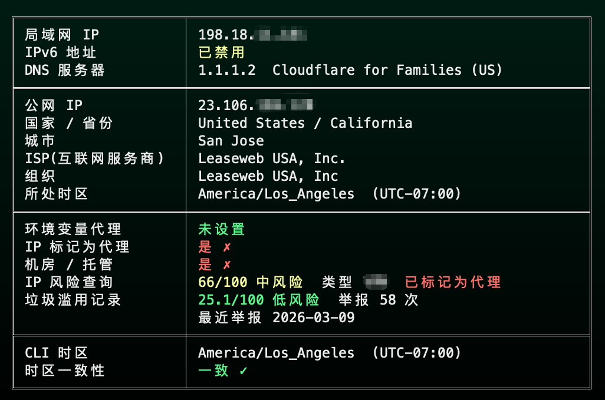

## 一个检测 Claude 运行环境的小脚本

> python ip_check.py

有些系统可能需要安装依赖，成功执行后他长这样：

### a. 第一栏检测你的局域网 IP 地址，IPv6 是否禁用，以及 DNS 地址

这里解释下，IPv6 建议禁用，几乎不影响，因为 IPv6 如果你打开的话，大部分代理是不处理 IPv6 的，意味着它可能会暴露你两个地址，一个 IPv4 显示美国，一个 IPv6 显示中国，那不相当于告诉 Claude 你有问题么。

DNS 也会暴露你真实地址，所以检测下你的 DNS 是国内还是国外，如果是国内，去你的代理软件设置下。

### b. 第二部分我用了一个公开检测出口 IP 的接口，直接显示你代理之后的 IP，国家，运营商以及时区，这个检测出的时区就是你前面 zshrc 里你手动设置的时区，保持一致。

### c. 第三部分，检测你 IP 代理是机房还是住宅，即便是机房也不一定有问题，我会自动检测这个机房 IP 的风险评分，以及这个 IP 是否被滥用。如果检测出你的 IP 风险很高，那么建议赶紧换节点。

### d. 最后一部分就很简单了，就是比对公网检测的时区是否和你本地配置文件里 zshrc 设置的一致。

我本地环境变量设置的是 America/Los_Angeles，而公网检测出的地区是 United States / California，UTC 一致，所以就没问题了。

以后开启代理，选择节点只需要运行下这个脚本，就可以检测是否可以直接跑 Claude 了。

最后，想说一句，这个脚本只帮你检测基础的一些 Claude CLI 运行环境配置，尽最大可能规避封号的可能，但是不能保证 Claude 不封你号，封号是一个综合维度判断的评分权重，我们能做的，就是尽量把每一个细节都做到位，最大概率保证让各位的 Claude 账号顺利使用。